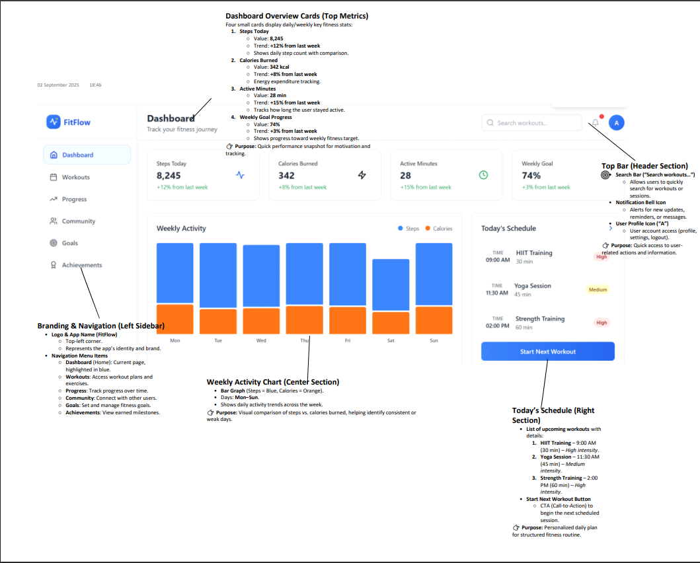

# UI-UX-Experiment2
# NAME: SHANMUGAKARTHIK G
# REG.NO: 212223220105
## Aim:
To design a basic mobile and web layout for an existing case study by applying Gestalt principles, incorporating essential UI elements and design patterns, establishing effective interaction behaviors, and usability principles, and creating a brand logo according to styling and branding guidelines.​
## Algorithm:
1. Study the Case: 
    
    Understand the problem statement and requirements of the selected case study.

2. Identify Key UI Elements: 

    List out the necessary interface elements for both mobile and web platforms (headers, buttons, navigation bars, cards, etc.).

3. Apply Gestalt Principles:

    Use proximity, similarity, continuity, closure, figure/ground, and symmetry to organize elements visually and improve user comprehension and navigation.​

4. Design Layouts:

    Sketch basic wireframes/layouts for mobile and web.

    Place UI elements according to Gestalt principles (group related items, highlight calls to action, align components for logical flow, etc.).

5. Integrate UI Patterns:

    Use established design patterns like navigation bars, floating action buttons, form layouts, etc., as per platform standards.

6. Develop Interaction Behaviors & Usability Principles:

    Define how users will interact with key components (click, tap, swipe, hover).

    Ensure usability principles are followed (clarity, accessibility, feedback).

7. Create Brand Logo:

    Design the logo in Canva following specified branding/styling guidelines.

    Export and include the logo in layouts.

8. Compile Outputs:

    Prepare final mockups for mobile and web layouts displaying application of principles and patterns.

    Document design decisions, behavioral flows, and usability improvements.
## Output:

## Result:
The mobile and web layouts feature enhanced usability and visual organization using Gestalt principles, modern UI patterns, and brand-consistent logo integration.